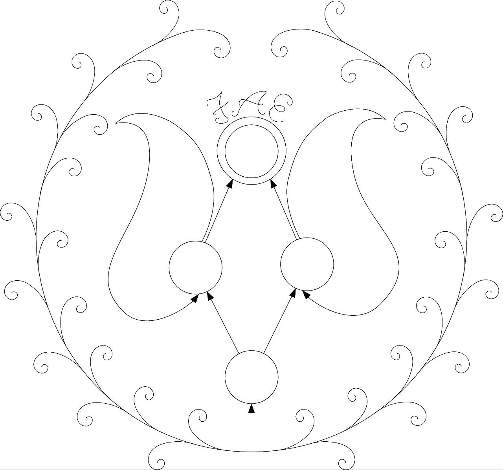

<div id="top"></div>

<!-- PROJECT LOGO -->
<br />
<div align="center">
  <a href="../public/assets/icons/logo.jpg">
    
  </a>

  <h3 align="center">Finite Automaton Editor (FAE)</h3>

  <p align="center">
    A user-friendly app for building and testing automatons
</div>

<!-- TABLE OF CONTENTS -->
<details>
  <summary>Table of Contents</summary>
  <ol>
    <li>
      <a href="#about-the-project">About The Project</a>
      <ul>
        <li><a href="#built-with">Built With</a></li>
      </ul>
    </li>
    <li>
      <a href="#getting-started">Getting Started</a>
      <ul>
        <li><a href="#prerequisites">Prerequisites</a></li>
        <li><a href="#installation">Installation</a></li>
      </ul>
    </li>
    <li><a href="#usage">Usage</a></li>
    <li><a href="#roadmap">Roadmap</a></li>
    <li><a href="#contributing">Contributing</a></li>
    <li><a href="#license">License</a></li>
    <li><a href="#contact">Contact</a></li>
    <li><a href="#acknowledgments">Acknowledgments</a></li>
  </ol>
</details>

<!-- ABOUT THE PROJECT -->

## About The Project

This project falls under my MSc Computer Science research. It is starting out simple with a user-friendly interface for building and testing automata. Later down the line we are planning on adding automata-based games and more.

<p align="right">(<a href="#top">back to top</a>)</p>

### Built With

As the project grows and more layers are added to the architecture this section will be updated. For now it is entirely frontend and built entirely with React.

- [React.js](https://reactjs.org/)

<p align="right">(<a href="#top">back to top</a>)</p>

<!-- GETTING STARTED -->

## Getting Started

To get a local copy up and running follow these simple example steps.

### Prerequisites

The following needs to be installed before you can start working on the project.

- Git - [Download & Install Git](https://git-scm.com/downloads). OSX and Linux machines typically have this already installed.
- Node.js - [Download & Install Node.js](https://nodejs.org/en/download/) and the npm package manager. If you encounter any problems, you can also use this [GitHub Gist](https://gist.github.com/isaacs/579814) to install Node.js.

### Installation

1. Navigate to the location you want this repo to be stored on your pc
2. Clone the repo
   ```sh
   git clone git@github.com:SJ-Jordaan/fae-mobile.git
   ```
3. Install NPM packages
   ```sh
   npm install
   ```

<p align="right">(<a href="#top">back to top</a>)</p>

<!-- USAGE EXAMPLES -->

## Usage

This section will need to be completed at a later time.

<p align="right">(<a href="#top">back to top</a>)</p>

<!-- ROADMAP -->

## Roadmap

- [x] Migrate to TypeScript
- [x] Migrate to React-Flow v10
- [ ] Fix UI issues with basic editor
  - [ ] Arrows between the same two nodes
  - [ ] More visual affordance to creating transitions
  - [ ] Creating a self-looping transition easier
- [ ] Add visual simulation for input provided

See the [open issues](https://github.com/SJ-Jordaan/fae-mobile/issues) for a full list of proposed features (and known issues).

<p align="right">(<a href="#top">back to top</a>)</p>

<!-- CONTRIBUTING -->

## Contributing

As of right now, this project is not accepting contributions unless you are working within the UP CS Department. Or are doing an Honours/Masters project under one their researchers

<p align="right">(<a href="#top">back to top</a>)</p>

<!-- LICENSE -->

## License

There is no license to use this project as it is currently for research purposes. There are no rights for the redistribution of this source code.

<p align="right">(<a href="#top">back to top</a>)</p>

<!-- ACKNOWLEDGMENTS -->

## Acknowledgments

These are packages or libraries that the project has found useful.

- [MUI](https://mui.com/)
- [React Flow](https://reactflow.dev/)
- [Tim Ruffles mobile-drag-drop](https://github.com/timruffles/mobile-drag-drop)

<p align="right">(<a href="#top">back to top</a>)</p>
